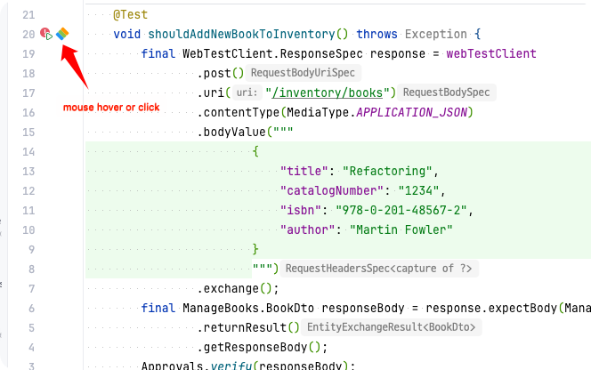

# Approvaltests xxx.approved.txt Viewer

An IntelliJ plugin that enhances test file navigation by providing quick access to TestClassName.methodName.approved.txt files from ApprovalTests.

## Overview

When working with [ApprovalTests](https://approvaltests.com/), checking test results in approved.txt files can be cumbersome. This plugin streamlines the process by adding interactive icons next to @Test methods, making it easier to view and access your test results.

## Key Features

- **Smart Test Detection:** Automatically identifies methods with @Test annotations
- **Quick Preview:** Hover over the icon to preview the approved file content without leaving your test
- **Direct Navigation:** Click the icon to open the corresponding approved file
- **Visual Feedback:** Clear notifications when approved files are missing

## How It Works

The plugin adds a colored bar icon next to each @Test method. This icon provides two main functions:
1. **Mouse Hover:** Shows a quick preview of the approved file content
2. **Click:** Opens the approved file directly in the editor

## Usage

Simply install the plugin and look for the colored bar icons next to your @Test methods. Hover over an icon to preview the content, or click it to open the full approved file.

## Demo
https://github.com/msbaek/approved-files-plugin/raw/main/usage.mp4
